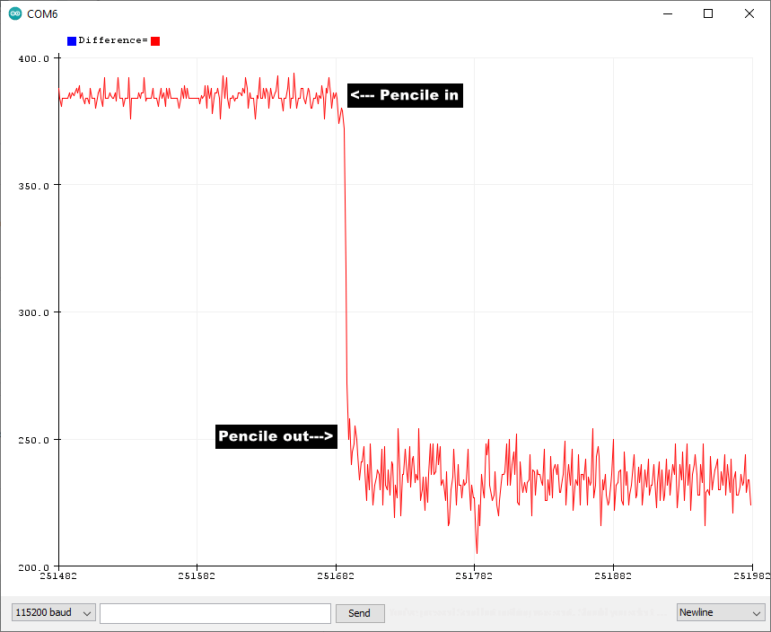

# sync_LED_detector
Synchronous LED Light Detection

Detects a pencil in a straw by bouncing light off of it.
Uses a single RGB LED by driving the Blue and Green on and off and using the Red as a photo cell detector.
ESP32 micro controler. 

Wired up on solderless breadboard

Wiring diagram
Circuit description
   RGB LED, common cathode. Cathode ground.
   ESP32 Pin  Breadboard Row  Resistor Pin
   GPIO12     7               R1-1
   GPIO14     8               R2-1
   GPIO27     9               R3-1
   ADC0       R1-1
   ADC3       R2-1
   ADC6       R3-1

   Note all resistors 300 Ohms.
   Resistor   LED
   R1-2       Anode red
   R2-2       Anode green
   R3-2       Anode blue

   GND        LED Common cathode
*/

Arduino IDE serial ploter output. Pencil in then out.

